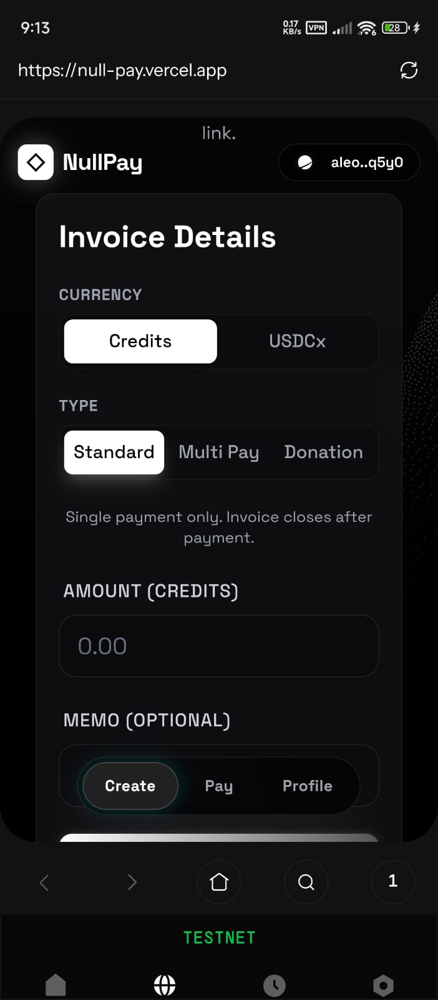
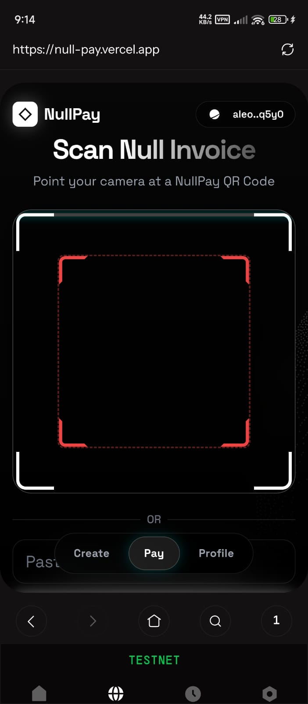
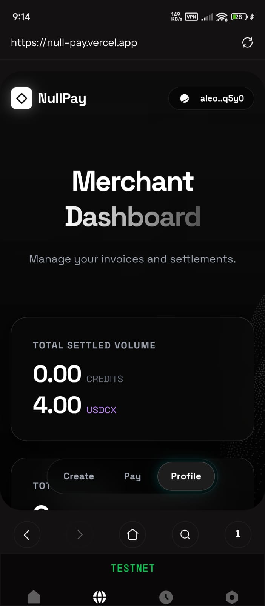

# NullPay

**Privacy-first payment protocol built on Aleo blockchain with zero-knowledge proofs**

NullPay is a decentralized invoice and payment system that leverages Aleo's zero-knowledge cryptography to enable private, verifiable transactions. Merchants can create invoices without revealing sensitive information on-chain, and payers can settle invoices while maintaining complete anonymity.

**Live Application:** [https://nullpay.app/](https://nullpay.app/)  
**Smart Contract:** [`zk_pay_proofs_privacy_v20.aleo`](https://testnet.explorer.provable.com/program/zk_pay_proofs_privacy_v20.aleo)  
**NullPay Node SDK:** [`@nullpay/node`](https://www.npmjs.com/package/@nullpay/node)  
**Vision:** [https://nullpay.app/vision](https://nullpay.app/vision)
**Documentation:** [https://nullpay.app/docs](https://nullpay.app/docs)
**NullPay SDK Demo:** [https://youtu.be/B1R0IWvNcVA](https://youtu.be/B1R0IWvNcVA)
**Live Notification Demo:** [https://youtu.be/VRV4q3nXc5I](https://youtu.be/VRV4q3nXc5I)

---


## 🚀 What's New in Wave 3 (March 2025)

We've just released our biggest update yet, expanding NullPay from a basic payment tool to a full-fledged privacy infrastructure.

### 📦 NullPay Node SDK & API Standardization
- **Universal SDK**: The new `@nullpay/node` SDK allows merchants to create hosted checkout sessions, retrieve payment statuses, and verify webhooks.
- **Clean API**: We've completely removed legacy `/v1` versioning across the entire stack (Backend, SDK, and Frontend) for a more stable and professional `/api` structure.
- **Hosted Checkout**: Merchants can now redirect customers to a high-conversion, hosted payment page that handles all ZK proof generations automatically.

### 🛡️ Burner Wallets & Merchant Anonymity
- **Zero Identity Linkage**: Generate anonymous **Burner Wallets** locally in your browser. Decouple your main identity from your business payments.
- **On-Chain Recovery**: Burner credentials are encrypted with your main wallet key and optionally backed up to the Aleo chain for cross-device synchronization.

### 💵 Comprehensive Token Support (Credits, USDCx, USAD)
- **Stablecoin Integration**: Full support for **USAD** alongside USDCx and Aleo Credits.
- **Token Denomination**: All transitions support native decimal precisions (e.g., 6-decimal precision for USAD/USDCx).
- **Dual Receipts**: Every payment atomically mints a `PayerReceipt` and `MerchantReceipt` on-chain, enabling private, off-chain proof of purchase.

### 🔔 Enterprise Realtime Infrastructure
- **Supabase Realtime**: Replaced legacy Socket.io with a robust, cloud-native notification system. Receive payments instantly without polling.
- **Interactive Alerts**: Built-in 3-tone chime sound and toast notifications allow merchants to keep the dashboard open and hear every new sale.
- **Automatic Polling Fallbacks**: Implemented 4-layer redundancy for transaction verification (WebSockets -> DB Polling -> Block Explorer API -> Shield Provider) ensuring no payment is ever missed.

### 🔄 Token-Agnostic Donation Campaigns
- **Universal Invoices**: Create donation links that accept **any** supported private token. The protocol automatically detects the payer's choice and routes to the correct on-chain transition.

---

## 📱 NullPay Mobile Version (Beta V1)

Access NullPay on the go directly through the **Shield Wallet** browser (available on the Play Store). While we are actively refining the design and performance for V2, the current V1 release is fully functional for all core payments.

### ⚠️ Current Limitations (Shield Wallet)
- **Auto-Decryption**: Limited support — users may need to manually decrypt records (one-click).


**Despite these minor inconveniences, NullPay Mobile is fully operational for creating invoices, sending payments, and managing history.**
| Invoice | Payment | Profile |
| :---: | :---: | :---: |
|  |  |  |

### Why Mobile?
Payments need to be instant and accessible anywhere. The mobile version bridges the gap between digital assets and real-world transactions:
- **Scan & Pay**: Instantly scan QR codes to make payments at physical stores.
- **On-the-Go Access**: Manage your invoices and payments without needing a laptop.
- **Seamless Sync**: Access the full-fledged dashboard on desktop anytime for detailed management.

---

## NullPay Architecture


---

## Features

### Core Capabilities
- **Zero-Knowledge Invoices**: Merchant addresses and amounts are hashed on-chain using BHP256, preserving privacy
- **Private Transfers**: Payments executed via Aleo's `transfer_private` (Credits) and private programs for `USDCx` and `USAD`
- **Standard Invoices**: Single-payment invoices that close upon settlement
- **Multi Pay Campaigns**: Multi-contributor invoices with individual payment receipts
- **Donation Invoices**: Open-ended invoices allowing variable payment amounts and **any token** type
- **Tamper-Proof Verification**: Mathematical hash verification prevents invoice manipulation
- **Encrypted Metadata**: Off-chain data encrypted with AES-256-GCM for additional security
- **Payment Receipts**: Unique receipt keys generated via cryptographic commitments for multi-pay tracking

### User Experience
- **Wallet Integration**: Seamless connection with Aleo wallet adapters (Leo Wallet, Puzzle Wallet, Shield, etc.)
- **Invoice Explorer**: Real-time tracking of invoice status and transaction history
- **Merchant Dashboard**: Track created invoices, payment status, and live balances across all supported tokens
- **Responsive Design**: Premium glassmorphism UI with fluid animations

---

## Architecture

NullPay consists of three main layers:

### Layer 1: Frontend (React + TypeScript)
The client-side application handles:
- Salt generation using `crypto.getRandomValues()` (128-bit entropy)
- Wallet adapter integration for transaction signing
- Invoice hash computation (client-side verification)
- Transaction submission to Aleo network
- Burner wallet management (local encryption)

### Layer 2: Smart Contract (Leo)
The on-chain protocol `zk_pay_proofs_privacy_v20.aleo` enforces:
- Hash integrity verification (`assert_eq(computed_hash, stored_hash)`)
- Invoice status management (0 = Open, 1 = Settled)
- Multi-token support (Credits, USDCx, USAD)
- Replay protection via payment receipt tracking
- Dual receipt generation (PayerReceipt and MerchantReceipt)

### Layer 3: Backend (Node.js + Supabase)
The indexer and database layer provides:
- Clean `/api` structure (unversioned for stability)
- Fast invoice lookups and state tracking
- AES-256-GCM encrypted storage for merchant/payer addresses
- Supabase Realtime integration for live notifications

**Data Flow:**
```
Merchant → Frontend → Smart Contract → Blockchain
                ↓
           Backend DB (Encrypted)
                ↓
           Payer → Frontend → Verify Hash → Pay Invoice
```

---

## Technology Stack

**Blockchain:**
- Aleo Testnet (Privacy-preserving L1)
- Leo Programming Language (Smart contract development)
- BHP256 Hash Function (ZK-optimized hashing)

**Frontend:**
- React 18 with TypeScript
- Tailwind CSS (Styling)
- Framer Motion (Animations)
- @nullpay/node (Integration SDK)

**Backend:**
- Node.js with Express
- Supabase (PostgreSQL + Realtime)
- AES-256-GCM Encryption
- CORS-enabled REST API

**Development Tools:**
- Leo CLI (Contract compilation)
- npm (Package management)
- Git (Version control)

---

## Getting Started

### Prerequisites

- Node.js (v18 or higher)
- npm

### Installation

**1. Clone the repository:**
```bash
git clone https://github.com/geekofdhruv/NullPay.git
cd NullPay
```

**2. Install dependencies:**
```bash
# Frontend
cd frontend && npm install
# Backend
cd ../backend && npm install
```

### Environment Setup

**Frontend (`frontend/.env`):**
```env
VITE_PROGRAM_ID=zk_pay_proofs_privacy_v20.aleo
VITE_BACKEND_URL=https://nullpay.app/api
```

**Backend (`backend/.env`):**
```env
SUPABASE_URL=your_supabase_url
SUPABASE_ANON_KEY=your_supabase_anon_key
ENCRYPTION_KEY=your_64_char_hex_key
```

**5. Start the backend:**
```bash
cd backend
npm start
```

**6. Start the frontend:**
```bash
cd frontend
npm run dev
```

The application will be available at `http://localhost:5173`

---

## Project Structure

```
AleoZKPay/
├── contracts/
│   └── zk_pay/
│       └── src/
│           └── main.leo          # Smart contract (v11)
├── frontend/
│   ├── src/
│   │   ├── components/           # Reusable UI components
│   │   ├── hooks/                # Custom React hooks
│   │   │   ├── useCreateInvoice.ts
│   │   │   └── usePayment.ts
│   │   ├── pages/                # Route pages
│   │   │   ├── CreateInvoice.tsx
│   │   │   ├── PaymentPage.tsx
│   │   │   ├── Explorer.tsx
│   │   │   ├── Profile.tsx
│   │   │   ├── Privacy.tsx
│   │   │   └── Docs.tsx
│   │   ├── services/
│   │   │   └── api.ts            # Backend API client
│   │   ├── utils/
│   │   │   └── aleo-utils.ts     # Salt generation, hash fetching
│   │   └── App.tsx
│   └── package.json
├── backend/
│   ├── index.js                  # Express server
│   ├── encryption.js             # AES-256-GCM encryption
│   └── package.json
├── docs/
│   └── future_wave.md            # Roadmap
└── README.md
```

---

## Smart Contract

The core contract `zk_pay_proofs_privacy_v20.aleo` is deployed on Aleo Testnet.

**Explorer Link:** [https://testnet.explorer.provable.com/program/zk_pay_proofs_privacy_v20.aleo](https://testnet.explorer.provable.com/program/zk_pay_proofs_privacy_v20.aleo)

### Key Transitions

#### 1. `create_invoice_any`
Creates a universal donation invoice that accepts any supported token.

#### 2. `pay_invoice_usad` / `pay_invoice_usdcx`
Executes private token payments with atomic receipt generation.

#### 3. `backup_burner_wallet`
Securely backs up encrypted burner wallet credentials to the chain for cross-device recovery.

---

## Security

### On-Chain Privacy
- **Merchant Address:** Hashed with BHP256 before storage
- **Invoice Amount:** Hashed with BHP256 before storage
- **Salt:** 128-bit entropy (2^128 search space)
- **Payment Receipts:** Commitment scheme prevents receipt forgery

### Off-Chain Security
- **AES-256-GCM Encryption:** Merchant and payer addresses encrypted at rest
- **Authenticated Encryption:** GCM mode provides integrity and confidentiality
- **Environment Variables:** Encryption keys stored securely
- **HTTPS Required:** Production deployments must use HTTPS

### Attack Mitigations
- **Replay Protection:** Payment receipts prevent duplicate payments with same secret
- **Hash Verification:** `assert_eq(computed_hash, stored_hash)` prevents tampering
- **Expiry Enforcement:** Block height checks prevent payment of expired invoices

---

## License

This project is licensed under the MIT License. See `LICENSE` file for details.

---

## Acknowledgments

Built with Aleo's privacy-preserving blockchain technology.

**Resources:**
- [Aleo Documentation](https://developer.aleo.org/)
- [Aleo Explorer](https://testnet.explorer.provable.com/)
- [NullPay Live App](https://nullpay.app)

**Contact:**
For questions or support, please open an issue on GitHub.
